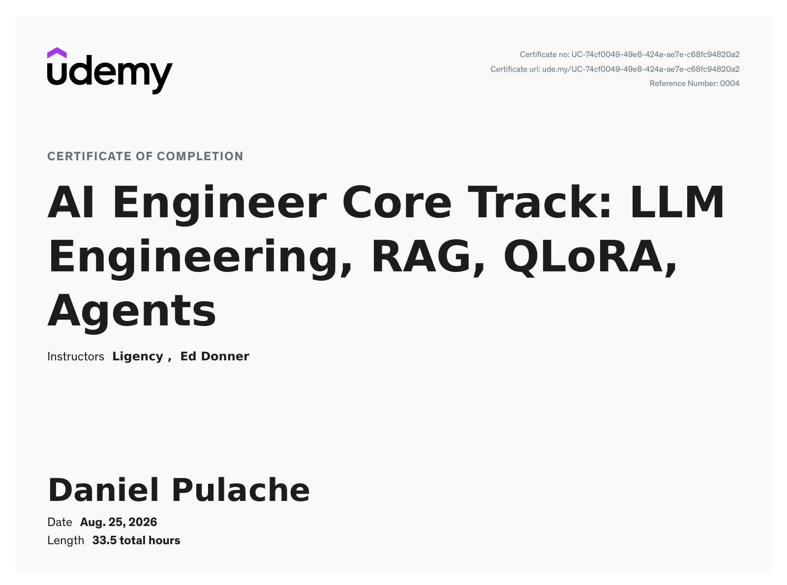

# Mastering Generative AI and LLMs: An 8-Week Hands-On Journey

This repository documents my hands-on journey through Ed Donner's Generative AI and LLM Engineering course. I'm Daniel and I'm working through the program week by week, using this space to capture what I build, what I learn, and how my understanding evolves across real-world AI projects.

Over the course of 8 weeks, this work explores practical LLM engineering through projects involving website-aware brochure generation, multimodal assistants, audio-to-notes pipelines, code optimization, RAG systems, fine-tuning, and autonomous agents. The goal of this repository is not just to store notebooks, but to showcase applied learning across the full lifecycle of modern AI products—from prompting and inference to training, evaluation, and deployment.

If you're curious about what it looks like to learn Generative AI by building, this repo is an open invitation to explore the experiments, summaries, and project work collected here. It reflects both the breadth of the course and my own progress as I develop stronger practical skills with tools and techniques such as Hugging Face, LangChain, Gradio, frontier APIs, open-source models, RAG, QLoRA, and agentic workflows.

---

## Week 8 Summary
- **A production deal-hunting product, not a notebook demo** – The week ships an end-to-end "Price is Right" system: scan live bargain feeds, estimate true market value, pick the opportunity with the largest discount, and push an alert to a phone. That is the same loop used in procurement, marketplace ops, and competitive-price monitoring.
- **Serverless GPU inference as a product API** – Day 1 deploys the Week 7 fine-tuned Llama pricer on Modal, wrapping it as a `SpecialistAgent`. Teams get GPU-backed scoring without owning machines; keep-warm vs. scale-to-zero makes latency vs. cloud spend an explicit business knob.
- **Ensemble pricing beats any single model** – Day 2 combines the specialist (fine-tuned open model), a frontier LLM with RAG over ~400k–800k Amazon products, and a neural-network pricer. Weighted estimates reduce the cost of a wrong price—critical when a false "bargain" wastes buyer time or a missed one leaves money on the table.
- **RAG at inference time instead of more training** – Similar listings retrieved from Chroma give the frontier model comparable-sales context, the same pattern as appraisal, insurance, and listing tools that need a number *now* without another training run.
- **Always-on deal intake and human notification** – Day 3's `ScannerAgent` reads RSS, filters for clear prices and useful descriptions, and the `MessagingAgent` sends Pushover (or SMS) alerts. Monitoring turns into an exception channel: people only look when the spread is large enough to matter.
- **Planner agents that run the P&L loop** – Days 4–5 introduce a planning agent (and an autonomous tool-calling variant) that sequences scan → estimate → notify, remembers already-seen URLs, and only fires above a discount threshold. A Gradio UI makes the pipeline demoable to stakeholders.
- **Community extensions** – Student work reuses the same agent stack for rentals, groceries, and other verticals, showing the pattern is a reusable "find mispriced inventory" playbook, not a one-off Amazon scraper.
**Bottom line:** Week 8 is the capstone: owned models, RAG, ensembles, and agents become a live commercial system that finds underpriced goods and notifies a human before the window closes.
**Takeaway:** Learners leave with a deployable multi-agent product—serverless specialist inference, retrieval-backed pricing, deal scanning, and alerting—that maps directly to marketplace, procurement, and ops use cases.

## Week 7 Summary
- **Own the model instead of renting it forever** – The week fine-tunes an open-source Llama (Llama 3.2 3B) to predict price from description. For high-volume scoring, a specialist model you host is usually cheaper and more controllable than paying a frontier API on every item.
- **QLoRA makes custom LLMs affordable** – Day 1 centers on 4-bit quantization plus LoRA adapters so a full fine-tune fits a single Colab T4. That is the difference between "we need a research cluster" and "we can specialize a model this sprint."
- **Prompt-formatted training data as an asset** – Day 2 turns curated listings into instruction-style prompt/completion pairs and loads a base model. The same recipe applies to any structured prediction problem: salary bands, insurance quotes, SKU categorization, lead scoring.
- **Train, checkpoint, resume** – Days 3–4 run PEFT training with the option to continue from checkpoints. That is how teams recover from GPU preemption and iterate without throwing away compute.
- **Evaluation against the Week 6 baselines** – Day 5 measures the open model against traditional ML, neural nets, and frontier APIs. The business question is explicit: does a small, fine-tuned open model beat (or approach) GPT on *this* task at a fraction of inference cost and without sending catalog data to a third party?
**Bottom line:** Week 7 is how enterprises get domain-specialist LLMs on commodity GPUs—QLoRA, PEFT, and eval—so pricing (or any numeric prediction) can run in-house at scale.
**Takeaway:** Students finish able to fine-tune, evaluate, and ship an open-weight specialist, with a clear cost and privacy case versus calling a general-purpose API for every prediction.

## Week 6 Summary
- **Price from description as a commercial problem** – "The Price is Right" capstone starts here: estimate what an item should cost from text, using a large Amazon catalog scrape. That capability underpins dynamic pricing, deal finding, catalog QA, insurance, and any workflow that needs a fair-value number from unstructured copy.
- **Data curation as the highest-leverage step** – Day 1 treats scrubbing and sampling as the science, not busywork. Course framing: dataset R&D often moves error more than later hyperparameter tuning—the same lesson as production ML, where bad listings and outliers dominate model quality.
- **LLM rewriting as industrial preprocessing** – Day 2 standardizes messy product text with an LLM (lite run under ~$1; full ~800k items on the order of tens of dollars, or skip and load a prepared Hub dataset). The pattern generalizes to any vertical with noisy catalogs, CRM notes, or tickets, and echoes Week 5's semantic rewrite for retrieval.
- **Baselines before "just use GPT"** – Day 3 builds evaluation plus traditional ML (Random Forest, XGBoost). A full-catalog Random Forest reached about **$56** average error after a long run—proof that classical methods still matter when features are clear, and that you need a number to beat before buying GPU time.
- **Neural nets and frontier models as competing cost curves** – Day 4 walks from a from-scratch PyTorch network to zero-shot frontier inference. Leadership can compare "train a small net," "prompt GPT," and "fine-tune" on the same eval harness.
- **Fine-tuning a frontier model as a private specialist** – Day 5 fine-tunes GPT-4.1-nano via OpenAI (course example: ~20k examples for a few dollars; official guidance is that even 50–100 examples can move the needle). That is the path to a private variant that knows *your* price distribution without training an open model yet.
**Bottom line:** Week 6 builds the commercial spine of the capstone—curate, rewrite, measure, then escalate from classical ML to neural nets to a fine-tuned frontier pricer—so later weeks have a task with real dollar error, not a toy dataset.
**Takeaway:** Learners get a full pricing-ML playbook: data quality first, LLM preprocessing when text is messy, honest baselines, and a cheap fine-tune when generic models are not accurate enough.

## Week 5 Summary
- **RAG as the default enterprise LLM pattern** – Day 1 frames Retrieval-Augmented Generation as the fastest, lowest-cost path to domain-accurate assistants, building an "Insurellm Expert" that answers employee questions over internal docs without fine-tuning.
- **Vector databases and embedding strategies** – Day 2 introduces Chroma with `all-MiniLM-L6-v2` (384-dim, free, local), demonstrates recursive chunking (1000/200 overlap), and visualizes the vector space with t-SNE-teaching the full ingest-embed-index-query loop.
- **LangChain-standard RAG pipeline** – Day 3 wires a `Retriever` + `ChatOpenAI` into a 15-line `answer_question` function, proving that production-grade Q&A requires minimal code when the retrieval layer is solid.
- **Evaluation-first mindset** – Day 4 embeds a business-focused evaluation harness (MRR, nDCG, keyword coverage for retrieval; accuracy, completeness, relevance for answers) with a Gradio dashboard, making "does it work?" measurable before any user sees the system.
- **Advanced RAG: LLM-driven preprocessing, reranking, query rewriting** – Day 5 goes pro: an LLM chunks documents with semantic overlap, rewrites each chunk with a headline+summary for denser retrieval, then at query time rewrites the user question and reranks top-k results with a second LLM call-yielding measurable lifts on the eval suite.
- **Production-ready evaluation UI** – `evaluator.py` ships a polished Gradio dashboard that streams per-category MRR/accuracy bars and color-coded thresholds, giving stakeholders a live "health monitor" for the knowledge assistant.
**Bottom line:** Week 5 delivers the complete RAG lifecycle-ingest, index, retrieve, generate, evaluate, iterate-using only open-source embeddings, a local vector store, and cheap frontier models.  The patterns generalize to legal discovery, medical records, engineering specs, and any domain where institutional knowledge lives in documents.
**Takeaway:** Learners acquire a hardened, evaluated RAG template they can deploy Monday morning: chunk - embed - index - retrieve - rerank - answer - measure, with a dashboard that proves ROI to leadership.

## Week 4 Summary
- **Automated code porting for performance engineering** – Days 3 and 5 showcase prompting frontier models (GPT-5, Claude 4.5 Sonnet, Gemini 2.5 Pro, Grok 4) to translate Python into highly optimized C++ and Rust, then automatically compiling and benchmarking the output.
- **Multi-model benchmarking as a decision framework** – The notebooks run identical algorithms across 9+ models (including open-weight models via Groq, Ollama, OpenRouter) and measure wall-clock speedups, turning subjective "which model is better?" into quantitative cost-per-inference and latency-per-task data.
- **End-to-end compilation pipeline** – System-info detection, compiler flag tuning (`-Ofast -mcpu=native -flto=thin` for Clang; `-C opt-level=3 -C lto=fat` for Rust), and subprocess orchestration are scripted, delivering a push-button workflow from Python source to native binary.
- **Gradio dashboard for interactive experimentation** – A live UI lets engineers paste Python, select a model, port, compile, and compare outputs side-by-side, accelerating the inner loop of performance engineering.
- **Demonstrated 100x-1000x speedups** – In the course's benchmarks, the best generated Rust/C++ code ran ~33,000x faster than the reference Python (0.0003s vs. 33s), illustrating the ROI of LLM-assisted optimization for HPC, quant finance, simulation, and game-engine workloads.
**Bottom line:** Week 4 reframes LLMs as compilers-for-optimization: instead of hand-writing SIMD or managing memory, engineers describe intent in Python and let frontier models emit hardware-tuned systems code, validated by automated benchmarks.
**Takeaway:** Students leave with a repeatable, model-agnostic pipeline to accelerate numerical kernels, a framework for evaluating model coding ability on their own hardware, and a Gradio prototype they can extend into a team-internal "optimization copilot."

## Week 3 Summary
- **Accessible GPU compute via Google Colab** – Day 1 introduces Colab as a free or low-cost environment with T4 GPUs, removing hardware barriers for LLM experimentation and making frontier model inference accessible to every student.
- **Hugging Face pipelines for rapid prototyping** – Day 2 demonstrates the high-level `pipeline` API for instant access to thousands of open-source models (translation, summarization, zero-shot classification, text generation), enabling fast proof-of-concepts without boilerplate.
- **Tokenizer literacy for cost and context control** – Day 3 deep-dives into tokenization (BPE, WordPiece, SentencePiece), showing how token counts drive API costs and context-window limits-essential knowledge for production budgeting and prompt engineering.
- **Model internals and weight loading** – Day 4 unpacks the `transformers` model classes, configuration, and `from_pretrained` workflow, giving engineers visibility into model architecture, memory footprint, and device placement for deployment planning.
- **Audio-to-notes pipeline with speaker diarization** – Day 5 builds a meeting-minutes generator that transcribes audio (Whisper), identifies speakers, and summarizes with an LLM-directly applicable to corporate meeting automation, sales call analysis, and compliance logging.
- **Token-level inference visualization** – The `visualizer.py` module streams log-probs from OpenAI models and renders a directed graph of predicted vs. alternative tokens, providing an intuitive debugging tool for understanding model confidence, hallucination risk, and decoding behavior.
**Bottom line:** Week 3 bridges the gap between API-only usage and model-level engineering.  Students gain hands-on experience with open-source model ecosystems, token economics, audio multimodality, and inference introspection-core competencies for building cost-effective, observable LLM systems.
**Takeaway:** By week's end, learners can spin up GPU workloads in Colab, select and run open models via Hugging Face, estimate token costs, process audio end-to-end, and visualize what the model "thinks" at each decoding step.

## Week 2 Summary
- **Full‑stack brochure generator** – Day 5 extends the earlier summarisation work into a multi‑step, multi‑LLM pipeline that produces a polished marketing brochure.  It showcases how to collate data from a website, score and filter links, and feed structured prompts to an LLM for a cohesive narrative—a ready‑to‑deploy pattern for product‑marketing teams.
- **Unified conversation format** – Week 2 starts with a clear‑cut representation of how conversations are expressed as a list of message objects.  This structure is the backbone of any conversational AI assistant and is key for building context‑aware, stateful interactions.
- **Expanded model support and pricing awareness** – The days that follow demonstrate how to use multiple frontier models (Anthropic, Gemini, DeepSeek, Groq, OpenRouter) all through a single Python client API.  Students learn how to toggle between paid and free endpoints, giving them fine‑grained control over cost and performance for production workloads.
- **Conversational assistants as a ubiquitous use case** – Several notebooks (Day 3, Day 4, community contributions) illustrate building chatbots that answer questions, schedule meetings, or trigger external actions via APIs.  These assistants can be wired into customer‑facing portals, scheduling services, or internal tools, creating real business value by automating routine interactions.
- **Action‑capable agents** – The Airline Assistant (Day 4 and many community variations) shows how an LLM can act as an API client, searching flights and booking tickets.  The pattern – receive a user intent, transform it into an HTTP request, and return a natural‑language confirmation – is directly applicable to e‑commerce, travel, and travel‑technology startups.
- **Business‑centric UI frameworks** – The Gradio‑based notebooks provide instant front‑ends for LLM services.  They enable rapid prototyping of SaaS products, internal dashboards, or research prototypes with zero‑code user‑interfaces, fast‑tracking time‑to‑market.
- **Multi‑model orchestration** – Community notebooks showcase routing queries Between local models, cloud models, and specialized assistants using function‑calling or tool‑calling paradigms, illustrating how to design cost‑efficient, compliance‑aware supply chains for AI services.
- **Cross‑domain applications** – From forecasting flight bookings to drafting marketing copy, grading student assignments, to automating travel itineraries, Week 2 demonstrates the breadth of real‑world problems that can be solved with a well‑engineered LLM stack.
- **Community‑contributed extensions** – Assistant‑agents, Selenium scraping, and Lovelace‑style prompts appear in the community notebooks.  They provide concrete examples of how to surface business value by automating research, contracting, and presentation‑generation workflows.
**Bottom line:** Each notebook in Week 1 teaches a different way to harness generative AI for tangible business use cases: summarising company information, automating client deliverables, trading costs against model performance, and building end‑to‑end LLM‑powered pipelines.  These lessons lay the foundation for more advanced applications in the upcoming weeks.
**Takeaway:** Week 2 equips students with the ability to design, develop, and deploy context‑rich conversational agents that can interact with third‑party APIs, negotiate between paid and free models, and provide direct business value in domains ranging from travel to enterprise knowledge bases.

## Week 1 Summary
- **Educational foundation for real‑world LLM applications** – Day 1 introduces the first autonomous agent that collects, filters, and summarizes website content.  The notebook demonstrates how a single LLM call can digest a full web page and produce concise, actionable insights, directly applicable to marketing research, content curation, or any domain where fast summarization is needed.
- **API pros and cons: paid versus local** – Day 2 explains the OpenAI chat‑completion API and provides a side‑by‑side alternative using the free Ollama endpoint.  This gives students hands‑on experience with cost‑aware design: paid aerial‑model inference versus free, offline inference, and the operational trade‑offs involved.
- **Tokenizer basics and “memory” illusion** – The tokenizer cell in Day 4 clarifies token counting mechanics and illustrates how state is emulated across calls.  These concepts are critical when planning for context‑window limits in production Chat‑GPT deployments.
- **Full‑stack brochure generator** – Day 5 extends the earlier summarisation work into a multi‑step, multi‑LLM pipeline that produces a polished marketing brochure.  It showcases how to collate data from a website, score and filter links, and feed structured prompts to an LLM for a cohesive narrative—a ready‑to‑deploy pattern for product‑marketing teams.
- **Community‑contributed extensions** – Assistant‑agents, Selenium scraping, and Lovelace‑style prompts appear in the community notebooks.  They provide concrete examples of how to surface business value by automating research, contracting, and presentation‑generation workflows.
**Bottom line:** Each notebook in Week 1 teaches a different way to harness generative AI for tangible business use cases: summarising company information, automating client deliverables, trading costs against model performance, and building end‑to‑end LLM‑powered pipelines.  These lessons lay the foundation for more advanced applications in the upcoming weeks.
2 hidden lines
